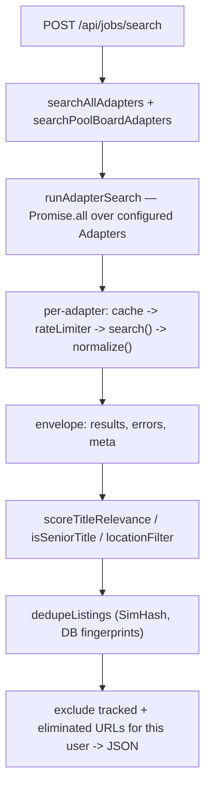

# Serpo Architecture

A map of how Serpo is put together — its layers, key modules, cross-cutting
conventions, durable state, and the operations/scripts that run it. Read this
before diving into the tree; it should give a fresh contributor (or agent)
enough context to find the right file without walking every directory.

Serpo is a **local-first, single-user job-search CRM**. One process serves a
Next.js App Router UI and API from one SQLite file, bound to `127.0.0.1` only.
See `README.md` for the product tour and `INTENT.md` for the "why".

## Guiding invariants

These are load-bearing; changes that violate them are almost always wrong.

- **Local-only, offline-capable.** No cloud dependency. Servers bind
  `127.0.0.1` (`package.json` `dev`/`start` use `-H 127.0.0.1`). Public
  deployment fails closed (`scripts/verifyDeploymentConfig.mjs` rejects
  `DEPLOYMENT_MODE=public`).
- **Single-user, password-free.** There is no auth workflow. `lib/auth/session.ts`
  (`getLocalUserId`) returns the sole owner row, creating one on first run;
  `/` and `/login` just `redirect("/dashboard")`. `User.passwordHash` is a
  schema vestige set to a disabled sentinel.
- **Integrations are opt-in and degrade gracefully.** Every external key lives
  in `.env.local` (all optional). Absent key ⇒ that feature is silently skipped,
  never a crash. AI is double-gated: it needs `ANTHROPIC_API_KEY` **and**
  `ENABLE_AI_ASSISTANCE=true` (default-deny proxy in `lib/ai/claudeClient.ts`).
- **Your data is destroyable.** `lib/privacy/purge.ts` `wipeAllData` clears this
  account's PII but preserves shared infrastructure (curated boards, the global
  search cache/fingerprints).
- **Fail closed on schema.** DB upgrades replay migrations in-memory, compare a
  schema fingerprint, and back up before touching `data/app.db`
  (`scripts/dbUpgradeAndVerify.mjs`).

## Stack

Next.js 16 (App Router, React 19 Server Components) · TypeScript · Prisma 7 +
`better-sqlite3` adapter · Tailwind CSS 4 · Zod · Anthropic SDK · Playwright
(the e2e runner, and the Chromium launcher for the dedicated app window in
`scripts/serpoHost.mjs`) · Vitest + MSW (unit). JobSpy scraping runs in a
separate Python sidecar, not Playwright.

## Directory map

| Path | What lives here |
|---|---|
| `app/` | App Router pages (server components) + `app/api/**/route.ts` HTTP handlers |
| `components/` | Client React components (forms, panels, board); fetch the API |
| `lib/` | All server-side domain logic (`"server-only"`), grouped by concern |
| `lib/db/prisma.ts` | The singleton Prisma client (better-sqlite3 adapter) |
| `lib/jobAdapters/` | Current per-source job fetch/normalize architecture |
| `lib/jobSources/` | Shared, source-agnostic filter / dedup / cache utilities |
| `prisma/schema.prisma` | Source of truth for the data model + generated client |
| `prisma/migrations/` | Hand-written SQL migrations (no `prisma migrate dev`) |
| `generated/prisma/` | Generated Prisma client (git-ignored) |
| `scripts/` | Setup, launch/quit lifecycle, installer, DB upgrade, JobSpy sidecar |
| `data/` | Durable state: `app.db`, backups, résumé artifacts (git-ignored) |
| `tests/` | `unit/` (Vitest+MSW), `e2e/` (Playwright), `fixtures/`, `setup/` |
| `docs/` | This file + design records and subsystem deep-dives |

## Layers & request lifecycle

```
Browser (components/*, client)
   │  fetch JSON
   ▼
app/api/**/route.ts               ── HTTP boundary
   ├─ requireJsonRequest(request)  (lib/security/guard.ts): Content-Type=application/json,
   │                               Origin==Host, ≤64 KiB — blind-CSRF / size guard
   ├─ requireApiUserId()           (lib/auth/session.ts): resolves the local userId
   ├─ Zod / manual validation      (lib/validators.ts + inline)
   ├─ domain call ──────────────▶  lib/<concern>/*  (business logic, "server-only")
   │                                     │
   │                                     ▼
   └─ NextResponse.json(...)        lib/db/prisma.ts ──▶ data/app.db (SQLite)
```

Pages under `app/` are **server components**: they call `lib/*` directly (no
self-fetch), then render client components that mutate via `app/api`. The root
`app/layout.tsx` wraps every page in `components/SideNav.tsx` (Dashboard,
Sourcing, Pipeline, Work, Contacts, Résumé, Settings, plus the **Quit** button).
Security headers (`nosniff`, `X-Frame-Options: DENY`, `no-referrer`) are set for
all routes in `next.config.ts`.

### Pages

| Route | Purpose |
|---|---|
| `/` , `/login` | Redirect to `/dashboard` (single-user, no auth) |
| `/dashboard` | Needs-attention queue, pipeline metrics, activity feed |
| `/sourcing` | Federated job search form + saved job-board panel |
| `/pipeline` | Drag-and-drop status board (`@dnd-kit`) |
| `/work` | Task + apply-run work queue |
| `/contacts` | Company-grouped contacts + interaction log |
| `/resume`, `/resume/[id]` | Résumé workspace (benchmark/improved/melded) |
| `/raekwon` | AI "lead report" batch generator (not in the main nav) |
| `/settings` | Profile answers, wipe-everything purge |
| `/applications/[id]` | Per-application record + unified timeline |

### API surface (`app/api/**`)

Grouped; every mutating route runs `requireJsonRequest` + `requireApiUserId`.

| Group | Endpoints (method varies) | Backed by |
|---|---|---|
| Sourcing | `POST /jobs/search` | `lib/jobAdapters/search.ts` + `lib/jobSources/*` |
| Lead reports | `/raekwon` | `lib/raekwon/*` (Claude + web_search) |
| Applications | `/applications`, `/applications/[id]`, `.../apply`, `.../apply/[runId]/confirm`, `.../contacts`, `.../messages`, `.../resume` | `lib/applications/*`, `lib/apply/*` |
| Messages | `/messages/[id]/approve`, `/messages/[id]/sent` | `Message` model lifecycle |
| Contacts | `/contacts`, `/contacts/[id]/interactions` | `lib/contacts/*`, `lib/osint/*` |
| Tasks | `/tasks`, `/tasks/[id]` | `lib/tasks/tasks.ts` |
| Job boards | `/job-boards`, `/job-boards/[id]`, `.../pool`, `/discover`, `/gather/integration-guide` | `lib/jobBoards/*` |
| Résumé | `/resume`, `/resume/[id]`, `.../regenerate`, `/resume-template` | `lib/resume/*` |
| Profile / aliases | `/profile-fields[/id]`, `/title-aliases[/id]` | `ProfileField`, `TitleAlias` |
| Privacy | `/privacy/purge` | `lib/privacy/purge.ts` |
| Lifecycle | `/health`, `/app/quit` | launcher probe / owned-process shutdown |

## Key domain modules (`lib/`)

| Module | Responsibility |
|---|---|
| `applications/` | `changeApplicationStatus` (the one stage-move write path; emits audit + Submitted side effects); `timeline` (merges audit/interactions/messages/apply-runs) |
| `apply/` | Apply-run workflow: `browserApply`, `tailorResume`, `renderDocx`, `resumeArtifacts`, submission signals/state machine |
| `outreach/` | `queueOutreachPreparation`/`prepareOutreach` — after an app hits Submitted, discover contacts + draft an AI outreach message (never sends) |
| `osint/` | Contact discovery connectors (Hunter.io); domain guessing |
| `contacts/` | Reusable, company-grouped contacts; find-or-create + link-to-application |
| `tasks/` | User-created tasks (the only persisted "to-do"; other signals are derived) |
| `scheduler/` | Derived signals computed on demand: `staleCheck` (90-day flag), `followUpCheck` (7-day due). Not cron — run at request time |
| `dashboard/` | `attention` (needs-attention queue), `metrics` (funnel), `activity` feed |
| `pipeline/` | Board data + stage-age helpers |
| `resume/` | Benchmark / improved / melded résumé generation (Claude), DOCX export, Zod schemas |
| `raekwon/` | Exploratory lead-report generation (Claude + `web_search`), archive |
| `ai/` | `claudeClient` (gated Anthropic proxy), `generateMessage`, `suggestJobTitles`, prompts |
| `jobBoards/` | Pool verification (is a pinned board live-queryable?), curated seed |
| `privacy/` | Account purge + per-application OSINT purge |
| `security/`, `http/`, `auth/`, `validators.ts` | Cross-cutting (below) |

## The job-search subsystem

The most involved area, split into two trees with a clear division of labor:

- **`lib/jobAdapters/` — fetch + normalize, per source.** Each source is an
  `Adapter` (metadata, `capabilities`, async `search()` generator, `normalize()`)
  under `adapters/<source>/`. `registry.ts` is the **only** file allowed to
  import a concrete adapter (enforced by
  `tests/unit/jobAdapters/noAdapterImportsOutsideRegistry.test.ts`); adding a
  source = one entry in its `ADAPTERS` array. `runSearch.ts` fans out over
  adapters with `Promise.all`, giving each a per-call `context.ts`
  (`services/`: `cache`, `rateLimiter`, `circuitBreaker`, `httpClient`,
  `scrapeScheduler`, `logger`) and returning a `{ results, errors, meta }`
  envelope — a broken source returns its own error rather than failing the
  whole search (per-source timeout + circuit breaker). The response still waits
  for all selected adapters; it does not stream fast-source results separately.
  Context deadlines start on first `signal`/`deadline` access, not creation.
  Queued JobSpy adapters defer that access until execution. Listings are normalized to the rich
  `NormalizedJobListing` Zod schema in `types.ts`.
- **`lib/jobSources/` — shared, source-agnostic post-processing.** Title
  relevance tiers (`titleMatch`, `roleFamilies`, `titleAliases`), location/remote
  filters (`locationFilter`), SimHash dedup with DB-backed fingerprints
  (`dedupe`, `simhash`, `staffingAgencies`), the per-criteria result `cache`, and
  the flat `JobSearchResult` shape these consume.

`lib/jobAdapters/search.ts` bridges the two, translating the new schema back to
the flat listing shape and exposing `searchAllAdapters` (static sources) and
`searchPoolBoardAdapters` (a user's live-pinned Greenhouse/Lever boards).



Sources: keyless (Remotive, Himalayas, Jobicy, Arbeitnow, RemoteOK), keyed
(Adzuna, USAJobs, Jooble), per-company ATS (Greenhouse, Lever), and five **JobSpy**
adapters generated from `lib/jobSpyBoards.ts`: `jobspy:indeed`,
`jobspy:linkedin`, `jobspy:zip_recruiter`, `jobspy:glassdoor`, `jobspy:google`.
The search form selects boards individually; each has separate cache/error state.
`services/scrapeScheduler.ts` serializes their subprocesses across searches,
joins identical in-flight queries, and persists per-board request reservations
before starting work. A local failure propagates without adding a board-failure
cooldown; only a valid failure envelope from the helper can add one. Abort/timeout
errors retain their type, and the queue stays occupied until the child closes.
See [request controls](jobspy-request-controls.md),
[source authoring](adding-a-source.md), and [adapter design](adapter-interface.md).

## Durable state

Domain records persist in **one SQLite file** (`data/app.db`) through
`lib/db/prisma.ts` — a process-global Prisma client (reused across dev hot
reloads) over the `better-sqlite3` adapter, path resolved from `DATABASE_URL`
(default `file:./data/app.db`). JobSpy request limits are a separate JSON sidecar
beside that database; résumé artifacts are separate files.

Model groups (`prisma/schema.prisma`):

- **Identity:** `User` (the lone owner).
- **Pipeline:** `Application`, `ApplyRun`, `Message`, `AuditEvent`.
- **CRM:** `Contact`, `ContactApplication`, `Interaction`, `Task`.
- **Sourcing:** `JobBoard`, `JobBoardPin`, `TitleAlias`, `EliminatedJob`, and the **global**
  `JobSourceCache` + `JobListingFingerprint`.
- **Résumé/leads:** `ResumeTemplate`, `ResumeWorkspace`, `ProfileField`,
  `RaekwonReport`, `RaekwonLead`.

**Per-account vs. shared:** most rows are `userId`-scoped and cascade-deleted.
Curated `JobBoard` rows (`userId=null`), `JobSourceCache`, and
`JobListingFingerprint` are shared infrastructure — deliberately preserved by
`wipeAllData`. Audit events are the metrics substrate: written by
`lib/applications/changeStatus.ts`, `lib/apply/submission.ts`, and
`lib/outreach/autoPrepare.ts`; consumed by `lib/dashboard/metrics.ts`.

**`data/` contents:** `app.db` (live) · `app.db.backup-<timestamp>` (auto backups)
· `app.db.jobspy-state.json` (JobSpy per-site cooldown state) · `resumes/`
(tailored DOCX artifacts, keyed by application/apply-run) · `e2e.db` / `test.db`
(test fixtures) · `upgrade-fixture.db` (migration test input).

**Migrations** are hand-written SQL under `prisma/migrations/<timestamp>_<name>/migration.sql`.
`schema.prisma` drives the generated client; the DB is advanced by
`scripts/dbUpgradeAndVerify.mjs`, never `prisma migrate dev`. That script
replays every migration into an in-memory DB, fingerprints the schema at each
checkpoint, and only applies (inside a transaction, after a timestamped backup)
the migrations past the live DB's inferred checkpoint — failing closed on any
drift or ledger disagreement.

## Cross-cutting concerns

| Concern | Where | Notes |
|---|---|---|
| Auth / session | `lib/auth/session.ts` | `getLocalUserId` (aliased `requireApiUserId`, etc.); no passwords |
| Request guard | `lib/security/guard.ts` | `requireJsonRequest`: content-type + same-origin + 64 KiB cap |
| Outbound HTTP | `lib/http/requestJson.ts` | `requestJson` wraps fetch, normalizes non-2xx to `ApiRequestError` |
| SSRF / URL safety | `lib/security/externalUrl.ts` | Validates user-supplied external URLs |
| Deployment guard | `scripts/verifyDeploymentConfig.mjs` | Requires `DATABASE_URL`; rejects `DEPLOYMENT_MODE=public` |
| Validation | `lib/validators.ts` + inline Zod | Route-level input parsing |
| AI gating | `lib/ai/claudeClient.ts` | Proxy that throws unless `ENABLE_AI_ASSISTANCE=true`; model `CLAUDE_MODEL` |
| Audit | `AuditEvent` model | Written at status change / submission / outreach; feeds metrics + timeline |
| Derived signals | `lib/scheduler/*` | Stale (90d) + follow-up (7d) computed on demand, not persisted as tasks |
| Privacy purge | `lib/privacy/purge.ts` | `wipeAllData` keeps shared infra; `purgeContactResearch` spares contacts with history |
| Config / secrets | `.env.local` (see `.env.example`) | Read at point of use; per-feature knobs in `lib/jobSources/{timeoutConfig,dedupeConfig}.ts`, `lib/jobAdapters/config.ts` |
| Boot check | `instrumentation.ts` | On start, warns about unconfigured adapters (never crashes) |

## Operations & scripts

**npm scripts** (`package.json`):

| Script | Does |
|---|---|
| `setup` | `scripts/setup.mjs` — idempotent bootstrap (see below) |
| `dev` / `start` | `next dev` / `next start`, both `-H 127.0.0.1` |
| `build` | `next build` |
| `lint` | ESLint |
| `verify:deployment` | `scripts/verifyDeploymentConfig.mjs` |
| `db:upgrade-and-verify` | `scripts/dbUpgradeAndVerify.mjs` (fail-closed migrate) |
| `test:unit` / `test:scripts` / `test:e2e` | Vitest / Node script tests / Playwright |
| `test` | Unit + script + e2e suites |
| `verify` | Full release gate: lint + `tsc --noEmit` + deployment check + build + unit + script + e2e tests (CI runs the same) |
| `build:installer` / `build:icon` | `scripts/buildInstaller.ps1` / `scripts/buildIcon.mjs` |

**First-run setup** (`scripts/setup.mjs`, safe to re-run): checks Node ≥ 20.9,
installs npm deps (by lockfile hash), generates the Prisma client, copies
`.env.example` → `.env.local`, then either creates `data/app.db` from migrations
or runs the fail-closed upgrade on an existing one.

**Windows launch / quit lifecycle** (the least-technical path):
`Serpo.vbs`/`Serpo.cmd` → `scripts/launchSerpo*.ps1` → `scripts/serpoHost.mjs`.
`serpoHost` runs setup, starts the Next server on a free port with a hidden
window, waits on `/api/health`, opens a dedicated Chromium window (installed Edge,
falling back to Chrome) with a separate profile under
`%LOCALAPPDATA%\Serpo\browser-profile`, and stands up a token-guarded local
**control server**. The in-app **Quit** button (`components/SideNav.tsx`) POSTs
`/api/app/quit`, which relays a bearer-authenticated shutdown to that control
server (`SERPO_CONTROL_PORT`/`SERPO_CONTROL_TOKEN`) so only the owned server tree
(including in-flight JobSpy subprocesses) is stopped — never processes by name or
PID. Logs go to `%LOCALAPPDATA%\Serpo`. `scripts/install.ps1` /
`buildInstaller.ps1` produce the one-click installer; `createShortcut.ps1` makes
the desktop shortcut.

**JobSpy sidecar:** `scripts/setupJobSpy.ps1` provisions a private Python 3.12 venv
(`.venv-jobspy`) pinned to `python-jobspy==1.1.82`. Readiness validates the installed
version and private request-hook signatures, not just package presence.
The adapter's cheap dependency probe only checks package availability; each
invocation of `scripts/jobspy_search.py` validates compatibility before installing
request guards or scraping. Setup failures exit nonzero with actionable stderr.
Each subprocess scrapes **one selected board** and returns an envelope containing
`site`, `items` (the `ADAPTER_FIELDS` projection), `status`, `details`, and
`retryAfterSeconds`. Requests are paced and hidden urllib3 retries are disabled.
`JOBSPY_TIMEOUT_MS` applies separately to each dequeued board, excluding queue wait.
Normal spacing and board-failure cooldowns persist in `<database>.jobspy-state.json`;
local process/parse failures do not create a failure cooldown or clear existing
reservations. Tunables and repair guidance: [JobSpy request controls](jobspy-request-controls.md)
and `.env.example`.

## Testing topology

- **Unit** (`tests/unit/`, Vitest): domain logic; job adapters replay real
  captured `tests/fixtures/<source>/*` responses through **MSW** (`tests/setup/mswServer.ts`)
  — zero live network. `tests/setup/` provides the migrated `test.db`, a
  `server-only` stub, and global setup. Adapter conformance:
  `lib/jobAdapters/testing/contractSuite.ts`.
  JobSpy adapter/scheduler regressions use controlled subprocess responses;
  `tests/unit/scripts/jobspySearchScript.test.ts` exercises helper behavior through
  Python without live job-board traffic.
- **E2E** (`tests/e2e/`, Playwright, `playwright.config.ts`): full-stack UI flows
  against a built app using `e2e.db`.
- **Scripts** (`tests/scripts/`): the launcher (`serpoHost.test.mjs`).

## Extending Serpo

- **New job source** → add one `adapters/<source>/` entry + register it in
  `lib/jobAdapters/registry.ts`; follow `docs/adding-a-source.md`. Do **not**
  import adapters outside the registry.
- **New API route** → `app/api/.../route.ts` guarded by `requireJsonRequest` +
  `requireApiUserId`; keep business logic in `lib/`.
- **Schema change** → edit `schema.prisma`, add a hand-written
  `prisma/migrations/<timestamp>_<name>/migration.sql`, run
  `npm run db:upgrade-and-verify`.

## Related docs

`docs/adapter-interface.md` (job-adapter contract) ·
`docs/adding-a-source.md` (source checklist) ·
`docs/decisions.md` (design decisions) ·
`docs/jobspy-request-controls.md` (JobSpy pacing) ·
`docs/architecture-audit.md` (historical pre-refactor job-source audit).
