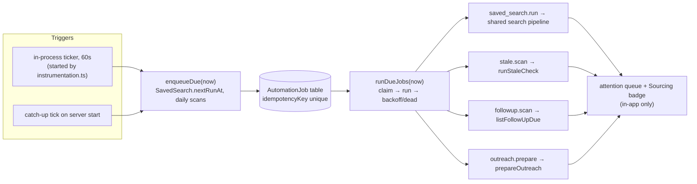

# Automation Plan

**Date:** 2026-09-27
**Status:** Implemented 2026-09-28 (phases A0–A3). "Later" is not started. [As built](#as-built) lists where the code settled details this plan left open. The "Current piping" section describes the code before this work.
**Goal:** While Serpo is open, it should do recurring work without anyone opening the dashboard: re-run saved searches, surface listings you haven't seen, run follow-up and stale reviews, and remind you. The human-approval invariants stay as they are: automation may search, flag, draft, and remind, but it never tracks a job, applies, or sends a message on its own.

**Owner decisions (2026-09-28):** nothing runs while the app is closed, and notifications stay inside the app. Work that came due while the app was closed runs once when it next opens.

This plan builds on three earlier documents: [readiness audit](product-readiness-audit-2026-08-08.md) P2-6 and Phase 3.3 (durable scheduler, timezone-aware, idempotent, retry/dead-letter, "never send automatically"), and [CRM plan](crm-dashboard-plan-2026-08-30.md) Phase 7 (saved searches with a "new since last run" count).

## Current piping

Serpo has no scheduler, job queue, job table, notification channel, or saved-search model. A search of `lib/`, `app/`, `scripts/`, and `components/` finds no `setInterval`, cron, Task Scheduler, or saved-search code. Everything that looks automatic today runs in one of two places: inside a request, or in `after()` just after one.

| Piece | Trigger | Where | Durable / retried? |
|---|---|---|---|
| Outreach prep (contact discovery + AI draft) | Application enters Submitted | `queueOutreachPreparation` → `after()` → `prepareOutreach` (`lib/outreach/autoPrepare.ts`) | No. Lost if the server stops mid-run. It is idempotent (skips when an IMMEDIATE draft already exists) and never throws: a failure becomes an `outreach_failed` audit event |
| Stale flagging (90 days) | Dashboard render | `runStaleCheck` in `app/dashboard/page.tsx` | Writes `staleFlaggedAt`; runs only when the dashboard is viewed |
| Follow-ups due (7 days) | Dashboard render | `listFollowUpDue` → attention queue (`lib/dashboard/attention.ts`) | Read-only derived signal |
| Tasks | Dashboard render | `listDueTasks` (`dueAt`, `snoozedUntil`) | Persisted, but only surfaced on view |
| Apply runs | User POST with `confirm: "APPLY"` + `idempotencyKey` | `app/api/applications/[id]/apply/route.ts` → `runApplyAutomation` | Runs synchronously in the request. `ApplyRun.idempotencyKey` is unique, a precedent for job idempotency. It never clicks Submit |
| Job search | User POST | `app/api/jobs/search/route.ts` | Results are not persisted per user. The shared `JobSourceCache` holds results for 15 minutes. `JobListingFingerprint` records each listing's first-seen time (`createdAt`) globally. Tracked and eliminated URLs are excluded per user |
| JobSpy pacing | Every JobSpy search | `lib/jobAdapters/services/scrapeScheduler.ts` | Serial queue; per-board spacing and cooldowns persist in `<db>.jobspy-state.json`, which unattended scraping needs |
| Server lifecycle | Serpo window | `scripts/serpoHost.mjs` | The Next server exists only while the app window is open: closing it stops the owned process tree. `--skip-browser` runs headless. A token-guarded control server (`/quit`, `/focus`) exists, and its port and token are passed to the Next child as `SERPO_CONTROL_PORT` / `SERPO_CONTROL_TOKEN` |
| Boot hook | Server start | `instrumentation.ts` `register()` | Runs once per server instance and must finish before the server accepts requests (Next.js docs: `node_modules/next/dist/docs/01-app/03-api-reference/03-file-conventions/instrumentation.md`) |

So when the window is closed, nothing runs at all. When it is open, work runs only because someone is clicking.

## Design

The job queue is a table in the same SQLite file. An in-process ticker runs the jobs, so automation exists only while the Serpo server is running; Quit stops it with everything else. This adds no service, no port, and no cloud dependency.

### 1. Data model (one hand-written migration)

- **`SavedSearch`**: `userId`, `name`, the full `JobSearchCriteria` (`keywords`, `location`, `remoteOnly`, `employmentType`, `jobSpySites` as JSON), `cadence` (daily, weekdays, or every N hours), `enabled`, `lastRunAt`, `nextRunAt`, `lastViewedAt`. The criteria reuse the search form's shape, so a contract search can be saved like any other.
- **`SavedSearchHit`**: `savedSearchId`, `listingId`, `url`, `firstSeenAt`, `dismissedAt`, unique on (`savedSearchId`, `listingId`). "New" means `firstSeenAt > lastViewedAt`. Dedupe works per family, so a repost of a listing already seen is not counted as new; filtering on the fingerprint's `isRepresentative` gives that.
- **`AutomationJob`**: `userId`, `kind` (`saved_search.run`, `stale.scan`, `followup.scan`, `outreach.prepare`), `payload` JSON, `runAt`, `status` (queued, running, done, failed, dead), `attempts`, `maxAttempts`, `lastError`, `lockedAt`, `finishedAt`, and a **unique `idempotencyKey`** such as `saved_search:<id>:<slot ISO>` or `outreach:<applicationId>`.
- **Automation settings** (on `User` or a one-row table): master switch (**default off**, since integrations are opt-in), IANA `timezone`, and per-board consent for unattended JobSpy runs.
- `lib/privacy/purge.ts` `wipeAllData` deletes each model explicitly (`deleteMany` per table). Add the new tables there. They are per-account data, not shared infrastructure.
- Apply the migration through `scripts/dbUpgradeAndVerify.mjs`, as always.

### 2. Executor

- **`lib/automation/schedule.ts` → `enqueueDue(now)`.** For each enabled `SavedSearch` with `nextRunAt <= now`, insert one job keyed to the current slot, then compute the next slot in the user's timezone. After a week closed, a search catches up once, not seven times. Daily `stale.scan` and `followup.scan` jobs use a per-day key.
- **`lib/automation/runner.ts` → `runDueJobs(now)`.**
  - Claim a job with a conditional update (`status='queued' AND runAt<=now` → `running`, `lockedAt=now`). SQLite has a single writer and there is one server process, so this is enough.
  - On failure, retry with backoff (e.g. 5 min, 30 min, 2 h). After `maxAttempts` the job becomes `dead`.
  - Jobs stuck in `running` past a lock timeout (the server died mid-job) go back to the queue.
  - Jobs run one at a time.
- **Ticker.** `instrumentation.ts` `register()` starts a `setInterval(tick, 60_000)` without awaiting it. `register` must finish before the server is ready, so a blocking first run would delay every launch. Guard it with a `globalThis` flag (the same pattern as `lib/db/prisma.ts`) so dev hot reload doesn't create two timers, and `unref()` the timer. The first tick fires immediately after start: that is the catch-up tick.
- **Handlers call existing domain code, never new copies of it:**
  - `saved_search.run`: first extract the body of `POST /api/jobs/search` into `lib/jobSources/runJobSearch.ts`: adapters, relevance, seniority, location and contract filters, dedupe, and tracked/eliminated exclusion. The route and automation then share one pipeline. Diff the result against `SavedSearchHit` and insert new rows. JobSpy boards still go through `scrapeScheduler`, so unattended runs obey the same persisted spacing and cooldowns.
  - `stale.scan`: `runStaleCheck`. Move it out of dashboard render; the dashboard keeps reading `listStaleApplications`.
  - `followup.scan`: `listFollowUpDue`, feeding notifications. Keep the `followUpGeneratedAt` semantics.
  - `outreach.prepare`: `queueOutreachPreparation` enqueues a job instead of calling `after()`, which makes it durable and retryable. `prepareOutreach` keeps its idempotency check. It needs a small change to report retryable failures (network, 5xx) to the runner, not only as audit events.

### 3. When the app is closed: nothing runs (decided)

No Windows Task Scheduler entry, headless wake-up, resident background service, or tray process. Closing the window or pressing Quit stops automation along with the server. Due work is picked up by the catch-up tick the next time Serpo starts: each saved search runs once for all the windows it missed, not once per window.

### 4. Notifications: in the app only (decided)

- Add two attention-queue kinds: `new_listings` (a count per saved search, linking to the search) and `automation_failed` (dead jobs, with a retry button). Add a count badge on the Sourcing nav item (`components/SideNav.tsx`).
- No Windows toasts, email, or other outside channels. Drafts stay drafts.

### 5. UI

- **Sourcing:** a "Save this search" action that captures the current criteria (including the Contract & temp switch and the selected JobSpy boards). Add a saved-searches panel with cadence, on/off, last run, a new-listing count, and "Run now".
- **Settings:** the automation master switch, timezone, and per-board consent for unattended scraping. Google Jobs is off by default: it already has a 900 s spacing and a `/sorry/` pause.

## Phases

| Phase | Delivers | Depends on |
|---|---|---|
| A0 | Extract the search pipeline from the route into `lib/`, with no behavior change | nothing |
| A1 | `SavedSearch` + `SavedSearchHit`, "Run now", new-since-last-view counts. Useful before any scheduler exists | A0 |
| A2 | `AutomationJob` table, runner, ticker, and catch-up on start. Move stale/follow-up scans and outreach prep onto the queue | A1 |
| A3 | Attention kinds, Sourcing badge, and automation settings (timezone, switch) | A2 |
| Later | RSS/Atom feeds as saved-search sources (the CRM plan's `rss-parser` idea); opt-in IMAP ingest of recruiter replies | A2 |

## Verification each phase must add

- **Unit:**
  - slot math across DST changes and timezones, and the one-catch-up-per-missed-window rule;
  - idempotency-key collisions;
  - claim → retry → dead transitions, and stale-lock recovery;
  - hit diffing that respects dedupe families and tracked/eliminated exclusion;
  - purge removing the new tables.
- **Script:** Quit (and closing the window) leaves no automation running, and the catch-up tick on the next start runs each missed saved search once (extend `tests/scripts/serpoHost.test.mjs`).
- **E2E:** save a search, run it, see the new count on the attention queue.

## Risks

- **Unattended scraping volume.** This is the largest ToS and blocking risk. Keep JobSpy's persisted spacing, cap saved-search cadence at daily for JobSpy boards, and require consent per board.
- **API quotas** (Adzuna's daily quota; Jooble and Careerjet limits are unknown). Runs within the 15-minute cache TTL cost nothing, and a cadence floor bounds the rest.
- **Double timers under dev hot reload.** Handled by the `globalThis` guard.
- **Slower server start.** Never await in `register()`.
- **Timezones.** Store UTC; compute slots in the user's IANA zone.

## Owner decisions (resolved 2026-09-28)

1. Saved-search hits go to a **separate triage inbox** on Sourcing: each saved search keeps its own list with Open, Track, and Dismiss. No `Shortlisted` stage; a hit enters the pipeline only when the user tracks it.
2. `followup.scan` **drafts follow-ups**: with AI assistance on, it writes the 7-day `FOLLOW_UP` draft for each due application and sets `followUpGeneratedAt`. With AI off it does nothing, and the attention queue still lists the follow-up.

## As built

- **Cadences:** `daily`, `weekdays`, `every_12h`, `every_6h`, all aligned to local midnight in the account's timezone (`lib/automation/slots.ts`). A time skipped by DST resolves forward by the size of the jump. A search with any JobSpy board may only use `daily` or `weekdays`, and 6 hours is the floor for everything else.
- **Master switch scope:** the switch (off by default) gates only unattended saved-search runs, since those are what contact job boards and APIs. The stale scan is local-only and runs daily either way. Follow-up drafting and outreach preparation stay gated by `ENABLE_AI_ASSISTANCE` and the Hunter key, as outreach already was, so the default-off switch takes nothing away.
- **Hit dedupe:** `SavedSearchHit` stores `familyId` next to `listingId`. A listing is new to a search only if neither its id nor its dedupe family already has a hit there. The plan's suggested `isRepresentative` filter would count a repost as new once a direct-employer post displaced an agency representative. Hits also store the listing JSON, following the `JobListingFingerprint` precedent, so the inbox can display and track a listing without fetching it again.
- **Runner:** statuses are `queued`, `running`, `done`, `failed` (awaiting a retry at `runAt`), and `dead`. There are 4 attempts, with backoff of 5 min, 30 min, and 2 h. The lock timeout is 60 minutes, longer than any legitimate job (a saved search can wait out JobSpy's 15-minute Google spacing). Done jobs are pruned after 30 days. Deleting a saved search deletes its queued and dead runs.
- **Outreach:** `outreach:<applicationId>` is re-armed when an application enters Submitted again after its job finished, so the old `after()` behavior of preparing again on each transition is kept. `prepareOutreach` rethrows only retryable failures (network, 408/429/5xx), and records `outreach_failed` on the timeline only on the final attempt.
- **Prisma client:** the client is now process-global in production too. `instrumentation.ts` and the routes load separate module copies, and two SQLite connections in one process could block on each other's transactions.
- **Verification split:** the script test (`tests/scripts/serpoHost.test.mjs`) proves that Quit and closing the window stop the process that owns the ticker. The catch-up-on-start rule is proven in Vitest (`tests/unit/automation/ticker.test.ts`), because running a real Next server inside the script suite would need a production build.
